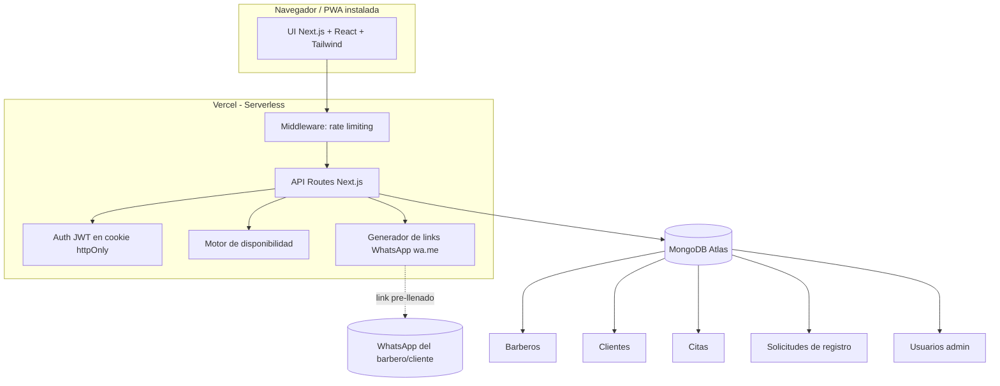
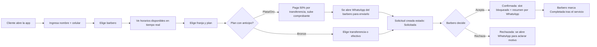
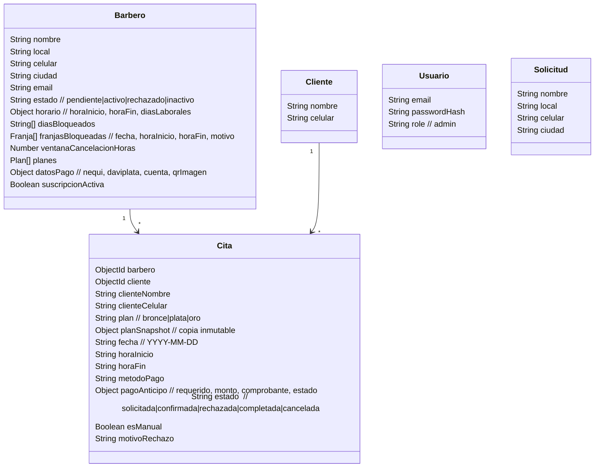

# Documentación del Proyecto — 770 Barbería

---

## 1. Objetivo

Ofrecer una plataforma web **serverless y 100 % gratuita** para que los clientes de **770 Barbería** (Caldas, Antioquia — Colombia) agenden sus citas en línea sin llamadas ni filas, y para que cada barbero gestione su agenda en tiempo real. El sistema elimina la fricción de la reserva tradicional con un motor de disponibilidad en vivo, planes de servicio diferenciados (Bronce, Plata, Oro) y comunicación por **WhatsApp**, sin pasarelas de pago ni servicios externos de notificación.

---

## 2. Información General

| Campo | Valor |
|---|---|
| **Nombre del proyecto** | 770 Barbería (repositorio: `citasbarber`) |
| **Versión** | 1.0.0 |
| **Última actualización de este documento** | 2026‑09‑10 |
| **Stack principal** | Next.js 14 (App Router) + React 18 + Tailwind CSS · API Routes (Node.js) · MongoDB Atlas + Mongoose · JWT · WhatsApp (`wa.me`) · Despliegue en Vercel |
| **Naturaleza** | Aplicación web instalable como **PWA** (Progressive Web App), pensada mobile‑first |

---

## 3. Actores del Sistema

| Actor | Responsabilidades |
|---|---|
| **Administrador** | Aprueba/rechaza barberos, activa/desactiva cuentas según la suscripción, y configura los planes (servicios, precios, duración, métodos de pago) de forma individual por barbero. |
| **Barbero** | Configura su horario laboral, bloquea días completos o franjas de horas (ausencias), acepta/rechaza/completa solicitudes, agenda citas manuales para clientes presenciales, edita su foto y redes, y revisa un resumen diario de cortes e ingresos. |
| **Cliente** | Se identifica solo con **nombre + celular** (sin contraseña), elige barbero/plan/horario, paga el anticipo por transferencia cuando aplica (subiendo comprobante y enviándolo por WhatsApp), consulta el estado de su cita y la cancela dentro de la ventana permitida. |

---

## 4. Descripción de la Necesidad

Los barberos de 770 gestionaban sus citas por llamadas y WhatsApp manual, lo que generaba dobles reservas, tiempos muertos y confusión de horarios. La app centraliza la agenda con:

* Un **motor de disponibilidad** que calcula franjas libres en tiempo real (paso de 15 min) evitando colisiones con citas, días bloqueados y franjas de ausencia.
* **Planes de servicio** con duración y anticipo diferenciados, y métodos de pago colombianos (Nequi, Daviplata, QR, cuenta bancaria, efectivo).
* **Comunicación por WhatsApp** (`wa.me`) con mensajes pre‑llenados para confirmación, rechazo y envío de comprobantes — sin costos de mensajería.
* **Registro sin fricción** para el cliente: solo nombre y celular; en visitas siguientes se le reconoce por el número.

---

## 5. Diagrama de Solución



---

## 6. Diagrama de Procesos (agendamiento)



---

## 7. Requerimientos Funcionales

| ID | Descripción | Criterio de aceptación |
|---|---|---|
| RF‑01 | Registro de barbero con nombre, local, celular, ciudad y email. | Queda en estado *Pendiente* hasta aprobación del admin. |
| RF‑02 | Aprobación/rechazo de barberos por el admin y activación/desactivación de cuentas. | El admin cambia el estado a *Activo*, *Rechazado* o *Inactivo*. |
| RF‑03 | Configuración de planes (servicios, precio, duración, anticipo, métodos de pago) por barbero. | El admin edita los planes de cada barbero de forma independiente. |
| RF‑04 | Login de barbero/admin con JWT en cookie `httpOnly`. | Credenciales válidas crean una sesión de 2 días; rutas protegidas exigen rol. |
| RF‑05 | Identificación del cliente solo con nombre + celular, sin contraseña. | En visitas posteriores el sistema reconoce al cliente por su celular. |
| RF‑06 | Visualización de horarios disponibles en tiempo real según plan elegido. | El motor descuenta citas, días bloqueados y franjas de ausencia; no ofrece horas pasadas. |
| RF‑07 | Creación de solicitud de cita con plan y método de pago correspondiente. | Bronce admite efectivo; Plata/Oro exigen anticipo del 50 % por transferencia. |
| RF‑08 | Envío de comprobante de anticipo por WhatsApp. | El cliente sube la imagen y se abre `wa.me` del barbero con mensaje pre‑llenado. |
| RF‑09 | Aceptar / rechazar / completar citas desde el panel (lista y calendario). | Al rechazar se abre WhatsApp con el cliente; al aceptar se bloquea el slot. |
| RF‑10 | Bloqueo de **días completos** y de **franjas de horas** (ausencias) por el barbero. | Los clientes dejan de ver ese tiempo al agendar; las franjas se ven en el calendario del barbero. |
| RF‑11 | Cita manual para clientes presenciales (sin celular). | Queda en el historial, la agenda y el resumen diario. |
| RF‑12 | Consulta y cancelación de la cita por el cliente solo con su celular. | Puede cancelar dentro de la ventana configurada por el barbero. |
| RF‑13 | Resumen diario del barbero (número de citas, ingresos estimados, desglose por plan). | Disponible en el panel del barbero. |
| RF‑14 | Instalación como app (PWA) desde la web pública. | Android instala en un toque; iOS muestra instrucciones (Compartir → Agregar a inicio). |

---

## 8. Manual Técnico

### 8.1 Stack y justificación

| Capa | Tecnología | Motivo |
|---|---|---|
| Frontend | Next.js 14 (App Router) + React 18 + Tailwind CSS | SSR/estático, integración nativa con Vercel, UI mobile‑first configurable. |
| Backend/API | **API Routes** de Next.js (Node.js) | Sin servidor Express aparte; funciones serverless en el mismo proyecto. |
| Autenticación | `jsonwebtoken` (JWT) en cookie `httpOnly` + `bcryptjs` | Stateless, simple y seguro; clientes sin contraseña (solo celular). |
| Base de datos | MongoDB Atlas (Free Tier) + Mongoose 8 | Modelo de documentos flexible para barberos, clientes y citas. |
| Motor de disponibilidad | Algoritmo propio (`src/lib/disponibilidad.js`) | Calcula slots en paso de 15 min descontando ocupaciones. |
| Calendario | Componente propio (`src/components/barbero/Calendario.js`) | Sin dependencias pesadas; vista semana/mes y timeline por día. |
| Pagos | **Sin gateway**: transferencia colombiana + comprobante por WhatsApp | Stack 100 % gratuito; verificación manual por el barbero. |
| Notificaciones | Links `wa.me` con mensaje pre‑llenado | Cero costo; el mensaje se adapta a móvil (emojis) o PC (texto plano). |
| PWA | `manifest.webmanifest` + service worker + banner de instalación | App instalable en pantalla de inicio. |
| Despliegue | Vercel | Deploy automático por push a `main`, CDN global, HTTPS. |

### 8.2 Dependencias principales

```jsonc
// Producción
"next": "14.2",
"react": "^18.3.1",
"react-dom": "^18.3.1",
"mongoose": "^8.6.0",
"jsonwebtoken": "^9.0.2",
"bcryptjs": "^2.4.3",
"date-fns": "^3.6.0",
"@phosphor-icons/react": "^2.1.10"

// Desarrollo
"tailwindcss": "^3.4.13",
"eslint" / "eslint-config-next": "14.2",
"mongodb-memory-server": "^10.1.2",   // Mongo en memoria para dev/pruebas
"playwright": "^1.62.1",
"postcss" / "autoprefixer"
```

> **No** se usan Stripe, SendGrid, Firebase/FCM, Express ni FullCalendar. Cualquier referencia a esas tecnologías está obsoleta.

### 8.3 Variables de entorno

| Variable | Descripción | Obligatoria |
|---|---|---|
| `MONGODB_URI` | Cadena de conexión a MongoDB Atlas. Si está vacía en dev, se levanta un Mongo **en memoria** con datos de ejemplo. | En producción |
| `JWT_SECRET` | Secret para firmar los JWT. Sin él, la app **lanza error en producción**. | En producción |
| `JWT_EXPIRES_IN` | Vida del token en segundos (por defecto `172800` = 2 días). | No |
| `ADMIN_EMAIL` | Email del administrador que crea el seed. | Para el seed |
| `ADMIN_PASSWORD` | Contraseña del administrador del seed. | Para el seed |
| `ALLOW_SEED` | Habilita el seed en entornos controlados. | No |

> Los valores reales **no** se versionan (ver `.gitignore`: `.env`, `.env.local`). Configúralos en el panel de Vercel.

### 8.4 Entorno de desarrollo

```bash
# 1. Instalar dependencias
npm install

# 2. Ejecutar en desarrollo (no requiere instalar MongoDB)
npm run dev
# Si MONGODB_URI está vacío, arranca Mongo en memoria + seed automático
# App disponible en http://localhost:3000

# 3. Build de producción
npm run build
```

---

## 9. Arquitectura de la Aplicación

### 9.1 Estructura de carpetas

```
src/
  app/
    page.js                     # Landing + lista de barberos
    agendar/[barberId]/         # Asistente de agendamiento (cliente)
    mis-citas/                  # Consulta/cancelación por celular
    barbero/{login,registro,panel,cambiar-password}/
    admin/{login,panel}/
    manifest.js                 # Manifest de la PWA
    layout.js                   # Layout raíz + metadatos + banner PWA
    api/                        # API Routes (ver 9.2)
  components/                   # UI, íconos, paneles barbero/admin, InstallPrompt
  lib/                          # db, auth, disponibilidad, whatsapp, constants, seed, emojis
  models/                       # Barbero, Cliente, Cita, Usuario, Solicitud (Mongoose)
  middleware.js                 # Rate limiting por IP
public/                         # Íconos PWA, service worker (sw.js), fotos
```

### 9.2 Endpoints (API Routes)

| Grupo | Rutas |
|---|---|
| Auth | `POST /api/auth/login`, `POST /api/auth/logout`, `GET /api/auth/me`, `POST /api/auth/registro-barbero` |
| Público (cliente) | `GET /api/barberos`, `GET /api/barberos/[id]`, `GET /api/barberos/[id]/disponibilidad`, `POST /api/clientes/identificar`, `GET /api/citas/consulta`, `POST /api/solicitudes` |
| Barbero | `GET/PUT /api/barbero/perfil`, `GET /api/barbero/resumen`, `POST /api/barbero/cambiar-password`, `GET /api/citas`, `PATCH /api/citas/[id]`, `POST /api/citas/manual` |
| Admin | `GET/POST /api/admin/barberos`, `... /api/admin/barberos/[id]` (+ `/planes`, `/password`), `GET /api/admin/solicitudes`, `... /api/admin/solicitudes/[id]` |

### 9.3 Modelo de datos (resumen)



### 9.4 Planes de servicio

| Plan | Duración (con buffer 5 min) | Precio ejemplo | Anticipo | Métodos de pago |
|---|---|---|---|---|
| **Bronce** | 25 min | $20.000 | No | Nequi, Daviplata, QR, cuenta, **efectivo** |
| **Plata** | 55 min | $45.000 | 50 % | Solo transferencia (Nequi, Daviplata, QR, cuenta) |
| **Oro** | 55 min | $70.000 | 50 % | Solo transferencia (Nequi, Daviplata, QR, cuenta) |

*(Precios y servicios son editables por el admin de forma individual por barbero.)*

---

## 10. Seguridad

- **JWT obligatorio en producción**: la app aborta el arranque si falta `JWT_SECRET`; en dev usa un secret local no válido para producción.
- **Cookie de sesión** `httpOnly`, `sameSite=lax`, `secure` en producción, expiración de 2 días.
- **Rate limiting** por IP (ventana deslizante en memoria) sobre login, registro de barbero, identificación de clientes y solicitudes (`src/middleware.js`).
- **Cabeceras de seguridad** en todas las rutas (`next.config.mjs`): `X-Frame-Options: DENY`, `X-Content-Type-Options: nosniff`, `Referrer-Policy`, `Strict-Transport-Security` (HSTS), `Permissions-Policy`.
- **Optimizador de imágenes desactivado** (`images.unoptimized`) para reducir superficie de ataque.
- **Sin secretos en el repositorio**: credenciales y `MONGODB_URI` viven solo en variables de entorno.

---

## 11. Despliegue

- Repositorio en GitHub conectado a **Vercel**; cada push a `main` genera despliegue automático.
- Variables de entorno definidas en el panel de Vercel (Settings → Environment Variables).
- Base de datos en **MongoDB Atlas**; en el primer arranque con base vacía, el seed crea el administrador.
