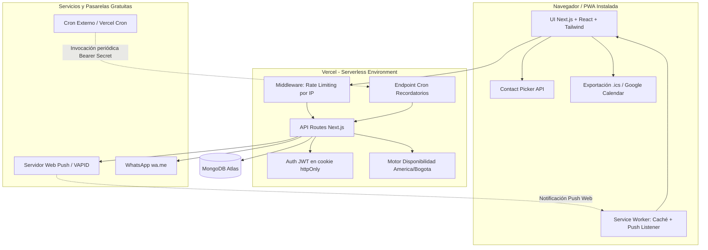
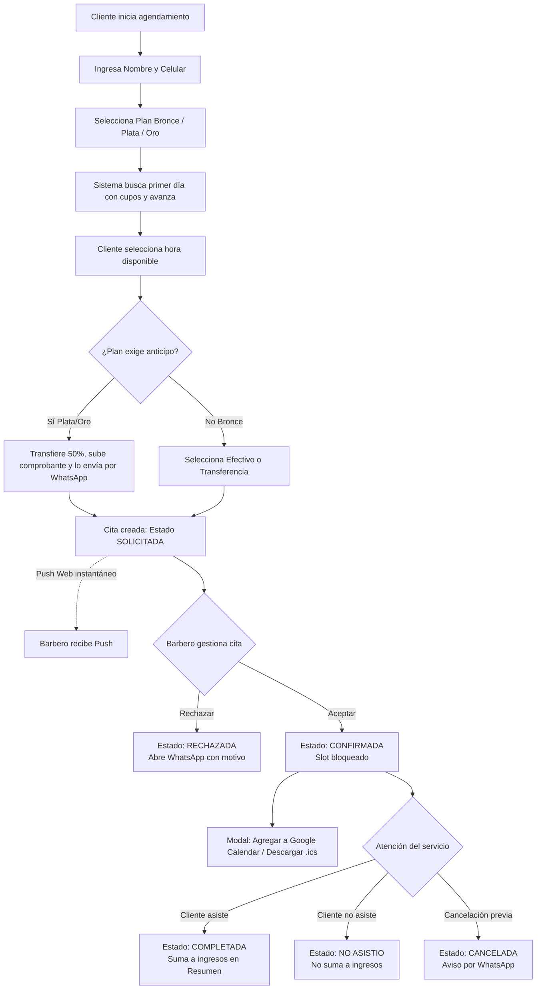
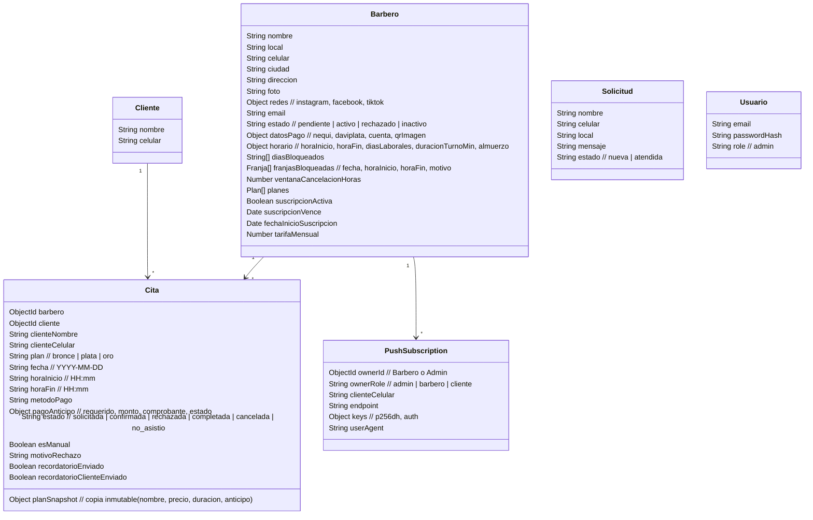

# Documentación del Proyecto — CitasBarber

---

## 1. Objetivo

Ofrecer una plataforma web **serverless y SaaS** orientada a la gestión integral de citas para **CitasBarber** y barberos independientes. El sistema elimina la fricción de la reserva tradicional con un motor de disponibilidad en tiempo real adaptado a la zona horaria colombiana, planes de servicio diferenciados (Bronce, Plata, Oro), comunicación directa por **WhatsApp (`wa.me`)**, notificaciones **Web Push (VAPID)** en segundo plano, sincronización directa con **Google Calendar y calendarios nativos (`.ics`)**, módulo de **Control de Suscripciones** mensual para el administrador y herramientas avanzadas de agenda para el barbero (como la **Contact Picker API** para clientes presenciales). Todo ello sin pasarelas de pago de terceros ni costos recurrentes de mensajería.

---

## 2. Información General

| Campo | Valor |
|---|---|
| **Nombre del proyecto** | CitasBarber (repositorio: `citasbarber`) |
| **Versión actual** | 1.2.0 |
| **Última actualización de este documento** | 2026‑09‑20 |
| **Stack principal** | Next.js 14 (App Router) + React 18 + Tailwind CSS · API Routes (Node.js Serverless) · MongoDB Atlas + Mongoose 8 · JWT en cookie `httpOnly` · Web Push (`web-push` / VAPID) · Integración iCalendar/Google Calendar · WhatsApp (`wa.me`) · Despliegue en Vercel |
| **Naturaleza** | Progressive Web App (**PWA**) instalable, optimizada mobile-first con soporte offline y eventos push |

---

## 3. Actores del Sistema

| Actor | Responsabilidades |
|---|---|
| **Administrador** | - Crea barberos manualmente o aprueba/rechaza solicitudes de registro.<br>- Gestiona el **Control de Suscripciones** mensual: supervisa el semáforo de vigencias (al día, por vencer, vencido), registra pagos de mensualidades, define tarifas individuales y envía recordatorios por WhatsApp.<br>- Configura planes de servicio, precios, duraciones y métodos de pago por barbero.<br>- Atiende solicitudes de prospectos recibidas desde la landing page. |
| **Barbero** | - Configura horario de trabajo, duración estándar de turnos, hora fija de **almuerzo** y bloqueos de días o franjas de horas (ausencias).<br>- Gestiona citas en vista **Hoy (Lista)** o **Calendario**: acepta, rechaza, completa, cancela o marca **"No asistió"**.<br>- Agrega citas automáticamente a **Google Calendar** o descarga archivos **`.ics`** (individuales o el día completo).<br>- Agenda citas manuales con autocompletado y selección desde la libreta de contactos del móvil (**Contact Picker API**).<br>- Consulta el **Resumen Diario** de ingresos con desglose de efectivo vs. transferencias/anticipos. |
| **Cliente** | - Se identifica únicamente con **Nombre + Celular** (sin contraseñas).<br>- Reserva mediante asistente con auto-avance y búsqueda automática de días con cupo.<br>- Paga anticipos por transferencia colombiana (Nequi, Daviplata, QR, cuenta bancaria) y envía el comprobante por WhatsApp.<br>- Consulta sus reservas activas e historial en el portal **Mis Citas**.<br>- Activa **recordatorios Web Push** para recibir avisos el día de su servicio y añade su cita al calendario de su dispositivo. |

---

## 4. Descripción de la Necesidad

El sistema resuelve integralmente la operativa diaria de las barberías en Colombia:
* **Disponibilidad precisa sin desfase horario**: Motor de cálculo en tiempo real (paso de 30 min) sincronizado con la zona horaria `America/Bogota` (UTC-5), evitando desfases producidos por servidores en UTC (Vercel) y descartando citas, días bloqueados, ausencias y la hora de almuerzo.
* **Reducción de inasistencias y olvidos**: Notificaciones Web Push inmediatas al barbero ante nuevas solicitudes, recordatorios programados por Cron al cliente el día de su cita y al barbero si una cita está por iniciar sin confirmar, y exportación a calendarios personales.
* **Control de clientes presenciales**: El barbero puede agendar clientes que llegan a pie buscando en el historial o abriendo la libreta telefónica de su celular en un toque.
* **Sostenibilidad SaaS**: Tablero de control para que el administrador supervise cobros recurrentes de mensualidades a los barberos, con alertas directas a WhatsApp.
* **Cero costos de intermediación**: Sin comisiones de pasarelas de pago ni cargos por SMS; el cliente transfiere directo a las cuentas del barbero y los comprobantes se validan visualmente.

---

## 5. Diagrama de Solución



---

## 6. Diagrama de Procesos (Agendamiento y Ciclo de Vida de Citas)



---

## 7. Requerimientos Funcionales

| ID | Módulo | Descripción | Criterio de Aceptación |
|---|---|---|---|
| **RF-01** | Administración | Creación directa de barberos por el Admin. | Permite registrar barbero con email, clave, local, celular, dirección, redes sociales, horario, tarifa mensual y planes en un solo modal. |
| **RF-02** | Administración | Control y aprobación de solicitudes de barberos. | El admin puede aprobar, rechazar o desactivar cuentas de barberos. |
| **RF-03** | Administración | Módulo de Control de Suscripciones (SaaS). | Visualización de semáforo (al día, por vencer en ≤5 días, vencido), KPIs de recaudo proyectado, registro de pago (+30 días o fecha personalizada) y enlace a WhatsApp de cobro. |
| **RF-04** | Administración | Gestión de solicitudes de contacto de la landing page. | Lista de prospectos interesados con contador de nuevos, respuesta rápida por WhatsApp, marcar como atendida y eliminar. |
| **RF-05** | Configuración | Configuración independiente de planes por barbero. | El admin edita servicios, precio, duración, anticipo (%) y métodos de pago para cada barbero de forma aislada. |
| **RF-06** | Seguridad | Autenticación con JWT en cookie `httpOnly`. | Sesión stateless segura de 2 días para admin y barberos. Rutas protegidas según rol. |
| **RF-07** | Clientes | Identificación ágil sin contraseña. | Registro únicamente con Nombre y Celular. Recordación del número en `localStorage`. |
| **RF-08** | Agendamiento | Asistente de reserva con auto-avance. | Al elegir plan busca automáticamente fecha con disponibilidad (próximos 30 días) y avanza a horarios; al elegir hora avanza a pago. |
| **RF-09** | Disponibilidad | Motor de disponibilidad en zona horaria de Colombia. | Calcula slots en paso de 30 min descartando citas, días bloqueados, ausencias y hora de almuerzo; bloquea fechas/horas pasadas según `America/Bogota`. |
| **RF-10** | Pagos | Gestión de anticipos y comprobantes. | Para planes Plata/Oro exige comprobante de pago; se envía al barbero vía WhatsApp prellenado. |
| **RF-11** | Citas | Ciclo de vida completo de citas. | Permite transicionar citas entre: `solicitada`, `confirmada`, `rechazada`, `completada`, `cancelada` y `no_asistio`. |
| **RF-12** | Calendario | Sincronización con calendarios personales. | Generación de enlaces para Google Calendar y descarga de archivos `.ics` (cita individual o paquete del día completo) tras confirmar o desde la lista. |
| **RF-13** | Cita Manual | Cita manual con Contact Picker API y autocompletado. | El barbero puede autocompletar clientes anteriores al escribir o abrir los contactos del móvil mediante la API nativa de Android/Chrome. |
| **RF-14** | Horarios | Configuración de jornada, ausencias y almuerzo. | Permite definir horario general, duración de turnos, hora fija de almuerzo y bloqueos inmediatos de días completos o franjas de horas. |
| **RF-15** | Clientes | Portal "Mis Citas" con pestañas. | Separa "Próximas citas" (destacando la más cercana o de hoy) e "Historial". Permite cancelar dentro de la ventana fijada por el barbero. |
| **RF-16** | Notificaciones | Notificaciones Web Push (VAPID). | Envío de notificaciones push al barbero (nueva cita), admin (nuevo contacto) y cliente (recordatorio de cita). Auto-suscripción en PWA instalada. |
| **RF-17** | Automatización | Cron de recordatorios programados. | Endpoint `/api/cron/recordatorios` que avisa al barbero de citas sin confirmar (~15 min antes) y al cliente en la mañana del día de su servicio. |
| **RF-18** | Reportes | Resumen diario financiero y operativo. | Métricas del día (totales, completadas, pendientes, canceladas, no asistidas) y desglose de ingresos en efectivo vs. transferencias/anticipos. |
| **RF-19** | PWA | Instalación PWA multiplataforma. | Instalación en un clic en Android/PC (`beforeinstallprompt`) e instrucciones guiadas en iOS. |
| **RF-20** | UI/UX | Sistema de diálogos modales nativos (`DialogProvider`). | Reemplazo de los `alert` y `confirm` del navegador por diálogos estilizados con soporte para acciones destructivas. |

---

## 8. Manual Técnico

### 8.1 Stack y Justificación

| Capa | Tecnología | Justificación |
|---|---|---|
| **Frontend** | Next.js 14 (App Router) + React 18 + Tailwind CSS | Renderizado híbrido eficiente, diseño mobile-first responsivo y componentes modernos. |
| **Backend / API** | Next.js Route Handlers (Node.js) | Serverless integrado en la misma base de código, sin necesidad de servidores Express adicionales. |
| **Base de Datos** | MongoDB Atlas + Mongoose 8 | Modelo documental flexible para esquemas con subdocumentos (horarios, planes, franjas). Soporte en memoria (`mongodb-memory-server`) para desarrollo sin dependencias. |
| **Autenticación** | `jsonwebtoken` (JWT) + `bcryptjs` | Manejo seguro de credenciales con cookies `httpOnly`, sin estado en servidor. |
| **Notificaciones Push** | `web-push` (Estándar VAPID RFC 8292) | Notificaciones nativas al navegador y celular sin requerir servicios pagos ni Firebase. |
| **Integración Calendario** | Formato iCalendar RFC 5545 (`.ics`) + Google Calendar URL | Sincronización universal compatible con Apple Calendar, Google Calendar, Android y Outlook. |
| **APIs Nativas del Navegador** | Contact Picker API (`navigator.contacts`) + Service Worker | Acceso seguro a la agenda del teléfono y soporte offline/push para PWA. |
| **Zona Horaria** | `Intl.DateTimeFormat` (`America/Bogota`) | Garantiza hora exacta de Colombia (UTC-5) en servidores serverless que operan en UTC. |

### 8.2 Dependencias Principales

```jsonc
// Producción (package.json)
"next": "14.2",
"react": "^18.3.1",
"react-dom": "^18.3.1",
"mongoose": "^8.6.0",
"jsonwebtoken": "^9.0.2",
"bcryptjs": "^2.4.3",
"date-fns": "^3.6.0",
"@phosphor-icons/react": "^2.1.10",
"web-push": "^3.6.7"

// Desarrollo
"tailwindcss": "^3.4.13",
"eslint": "^8.57.1",
"eslint-config-next": "14.2",
"mongodb-memory-server": "^10.1.2",
"playwright": "^1.62.1",
"postcss": "^8.4.47",
"autoprefixer": "^10.4.20"
```

### 8.3 Variables de Entorno

| Variable | Descripción | Entorno | Obligatoria |
|---|---|---|---|
| `NEXT_PUBLIC_BASE_URL` | URL base pública de la app (ej. `https://citasbarber.com` o `http://localhost:3000`). | Todos | Sí |
| `MONGODB_URI` | Cadena de conexión a MongoDB Atlas. Si está vacía en local, arranca MongoDB en memoria. | Producción | Sí en Prod |
| `JWT_SECRET` | Clave secreta para firmar tokens de sesión. La app aborta si no existe en producción. | Producción | Sí en Prod |
| `JWT_EXPIRES_IN` | Duración de la sesión en segundos (por defecto `172800` = 2 días). | Todos | No |
| `ADMIN_EMAIL` | Email del administrador para el seed inicial. | Desarrollo | Para seed |
| `ADMIN_PASSWORD` | Contraseña del administrador para el seed inicial. | Desarrollo | Para seed |
| `ALLOW_SEED` | Controla la ejecución del seed automático (`false` para desactivar). | Desarrollo | No |
| `VAPID_PUBLIC_KEY` | Clave pública VAPID para el servidor web-push. | Producción | Para Push |
| `VAPID_PRIVATE_KEY` | Clave privada VAPID para el servidor web-push. | Producción | Para Push |
| `VAPID_SUBJECT` | Contacto de soporte (`mailto:admin@dominio.com`) para el protocolo VAPID. | Producción | Para Push |
| `NEXT_PUBLIC_VAPID_PUBLIC_KEY` | Clave pública VAPID accesible en el cliente (idéntica a `VAPID_PUBLIC_KEY`). | Producción | Para Push |
| `CRON_SECRET` | Token Bearer secreto para proteger el endpoint `/api/cron/recordatorios`. | Producción | Para Cron |

### 8.4 Entorno de Desarrollo

```bash
# 1. Instalar dependencias
npm install

# 2. Iniciar en desarrollo local (arranca Mongo en memoria si MONGODB_URI está vacío)
npm run dev
# Disponible en: http://localhost:3000

# 3. Validar build de producción
npm run build
```

---

## 9. Arquitectura de la Aplicación

### 9.1 Estructura de Carpetas

```
citasbarber/
├── public/
│   ├── sw.js                             # Service Worker (caché offline y listener de push)
│   ├── icon-192.png, icon-512.png        # Iconos PWA
│   └── apple-touch-icon.png              # Icono para dispositivos Apple
├── src/
│   ├── app/
│   │   ├── layout.js                     # Layout raíz, tipografía, DialogProvider y prompts PWA
│   │   ├── page.js                       # Landing page pública, listado de barberos y modal de contacto
│   │   ├── manifest.js                   # Web App Manifest generado dinámicamente
│   │   ├── agendar/[barberId]/page.js    # Asistente de reserva paso a paso del cliente
│   │   ├── mis-citas/page.js             # Portal de consulta, historial y suscripción a recordatorios
│   │   ├── barbero/
│   │   │   ├── login/page.js             # Inicio de sesión del barbero
│   │   │   ├── registro/page.js          # Registro público de barbero
│   │   │   ├── cambiar-password/page.js  # Cambio obligatorio de contraseña temporal
│   │   │   └── panel/page.js             # Panel de control del barbero (Hoy, Calendario, Manual, etc.)
│   │   ├── admin/
│   │   │   ├── login/page.js             # Inicio de sesión de administrador
│   │   │   └── panel/page.js             # Panel de administración (Barberos, Solicitudes, Control)
│   │   └── api/                          # Endpoints API Routes (ver sección 9.2)
│   ├── components/
│   │   ├── Header.js, Avatar.js          # Componentes visuales transversales
│   │   ├── Icons.js                      # SVGs optimizados (WhatsApp, Tijeras, Calendario, etc.)
│   │   ├── EstadoBadge.js                # Badges de estado de citas con colores distintivos
│   │   ├── DialogProvider.js             # Contexto y modales personalizados para confirm/alert
│   │   ├── SocialLinks.js                # Enlaces de redes sociales y ubicación del barbero
│   │   ├── ContactoAdmin.js              # Modal "¿Tienes barbería?" para prospectos
│   │   ├── BotonInstalarApp.js           # Botón y modal de instalación PWA en el footer
│   │   ├── InstallPrompt.js              # Banner flotante de instalación PWA
│   │   ├── ActivarNotificaciones.js      # Componente de suscripción Web Push para paneles
│   │   ├── ActivarRecordatoriosCliente.js# Suscripción Web Push para clientes en Mis Citas
│   │   ├── admin/
│   │   │   ├── ControlSuscripciones.js   # Tablero de control de mensualidades y cobranza
│   │   │   ├── CrearBarberoModal.js      # Modal de creación directa manual de barbero
│   │   │   ├── EditorPlanes.js           # Editor de servicios, precios y pagos por barbero
│   │   │   └── EditorInfoBarbero.js      # Edición de datos generales y redes del barbero
│   │   └── barbero/
│   │       ├── CitasLista.js             # Lista cronológica de citas del día ("Hoy")
│   │       ├── Calendario.js             # Calendario interactivo (semana/mes/día) con acciones
│   │       ├── CitaManual.js             # Agendamiento presencial con Contact Picker y autocompletado
│   │       ├── ConfigHorario.js          # Configuración de jornada, ausencias y hora de almuerzo
│   │       ├── ResumenDiario.js          # Balance financiero (efectivo vs. transferencias)
│   │       ├── BotonCalendarioCita.js    # Menú desplegable para exportar a Google Calendar / .ics
│   │       └── ModalCitaConfirmada.js    # Modal post-confirmación con exportación individual o grupal
│   ├── lib/
│   │   ├── api.js, db.js, auth.js        # Helpers de API, conexión Mongo y extracción de sesión
│   │   ├── disponibilidad.js             # Motor central de disponibilidad en America/Bogota (UTC-5)
│   │   ├── calendario.js                 # Utilidades RFC 5545 para exportación iCalendar y Google Calendar
│   │   ├── push.js                       # Cliente web-push, envío a suscripciones y depuración 410
│   │   ├── whatsapp.js                   # Generador de enlaces wa.me con mensajes formateados
│   │   ├── constants.js, emojis.js       # Constantes del negocio y catálogo de emojis seguros
│   │   └── serializers.js, seed.js       # Serialización de objetos y datos de prueba
│   └── models/
│       ├── Barbero.js                    # Esquema de barberos, horarios, planes y suscripción
│       ├── Cita.js                       # Esquema de citas, snapshot del plan y estados
│       ├── Cliente.js                    # Esquema de clientes identificados por celular
│       ├── Solicitud.js                  # Esquema de mensajes de prospectos desde la landing
│       ├── PushSubscription.js           # Esquema de suscripciones Web Push por usuario/rol
│       └── Usuario.js                    # Esquema de usuarios con credenciales (admin)
└── middleware.js                         # Rate limiting en memoria por IP para rutas sensibles
```

### 9.2 Endpoints (API Routes)

| Módulo | Método y Ruta | Descripción |
|---|---|---|
| **Autenticación** | `POST /api/auth/login` | Inicia sesión (admin o barbero) y setea cookie `httpOnly`. |
| | `POST /api/auth/logout` | Limpia la cookie de sesión. |
| | `GET /api/auth/me` | Retorna la sesión activa descifrada del JWT. |
| | `POST /api/auth/registro-barbero` | Registro público inicial de barbero (queda en `pendiente`). |
| **Público / Clientes** | `GET /api/barberos` | Lista barberos activos con sus datos públicos. |
| | `GET /api/barberos/[id]` | Retorna el perfil y planes de un barbero específico. |
| | `GET /api/barberos/[id]/disponibilidad` | Calcula las franjas disponibles para una fecha y plan. |
| | `POST /api/clientes/identificar` | Registra o actualiza el cliente por su número celular. |
| | `GET /api/citas/consulta` | Retorna las citas próximas e históricas de un cliente por celular. |
| | `POST /api/citas` | Crea una nueva cita solicitada por un cliente (notifica vía push). |
| | `POST /api/solicitudes` | Recibe mensaje del formulario de contacto "¿Tienes barbería?". |
| **Barbero** | `GET, PUT /api/barbero/perfil` | Obtiene o actualiza horario, almuerzo, ausencias y datos del barbero. |
| | `GET /api/barbero/resumen` | Genera el balance del día con métricas y desglose de ingresos. |
| | `POST /api/barbero/cambiar-password` | Actualiza la contraseña obligatoria tras el primer ingreso. |
| | `GET /api/barbero/clientes` | Busca clientes frecuentes por nombre/teléfono para autocompletado. |
| | `GET /api/citas` | Lista citas del barbero filtradas por rango de fechas o estado. |
| | `PATCH /api/citas/[id]` | Acciones de cita: `confirmar`, `rechazar`, `completar`, `no_asistio`, `cancelar`, `confirmar-pago`. |
| | `POST /api/citas/manual` | Crea una cita presencial agendada directamente por el barbero. |
| **Administración** | `GET, POST /api/admin/barberos` | Lista barberos con filtros o crea un barbero manualmente. |
| | `PATCH, DELETE /api/admin/barberos/[id]`| Modifica estado/datos o elimina un barbero. |
| | `PUT /api/admin/barberos/[id]/planes` | Guarda la configuración de planes de un barbero. |
| | `PUT /api/admin/barberos/[id]/password`| Restablece la contraseña de un barbero. |
| | `GET /api/admin/solicitudes` | Lista las solicitudes de contacto de prospectos. |
| | `PATCH, DELETE /api/admin/solicitudes/[id]` | Atiende o elimina una solicitud de contacto. |
| **Web Push** | `POST /api/push/subscribe` | Registra o actualiza suscripción push de barbero o admin. |
| | `POST /api/push/unsubscribe` | Da de baja una suscripción push de barbero o admin. |
| | `POST /api/push/cliente/subscribe` | Registra suscripción push asociada al celular del cliente. |
| | `POST /api/push/cliente/unsubscribe`| Da de baja la suscripción push del cliente. |
| **Cron Jobs** | `GET /api/cron/recordatorios` | Invocación programada (Bearer Secret) para envío de recordatorios. |

### 9.3 Modelo de Datos



### 9.4 Planes de Servicio y Modelo SaaS

#### Planes de Servicio al Cliente (Configuración por Defecto)
* **Bronce**: Duración de 25 min (turno base de 30 min con 5 min de buffer). Incluye corte básico. Sin anticipo requerido. Acepta efectivo y transferencias. Precio referencia: $20.000 COP.
* **Plata**: Duración de 55 min (turno base de 60 min con 5 min de buffer). Incluye corte, mascarilla de puntos negros y depilación de vellos faciales. Exige anticipo del 50 % por transferencia. Precio referencia: $45.000 COP.
* **Oro**: Duración de 55 min. Incluye corte completo, mascarilla, depilación facial, bebida de cortesía y snack. Exige anticipo del 50 % por transferencia. Precio referencia: $70.000 COP.

*(Los precios, servicios y anticipos son completamente personalizables para cada barbero por el Administrador).*

#### Modelo de Suscripción SaaS para Barberos
* **Tarifa Mensual**: Configurable por barbero (por defecto $20.000 COP/mes).
* **Control de Cobranza**: El administrador monitorea el tablero con estados visuales:
  - *Verde (Al día)*: Vigencia mayor a 5 días.
  - *Amarillo (Por vencer)*: Vence en 5 días o menos.
  - *Rojo (Vencido)*: Fecha expirada.
* **Acciones de Cobro**: Enlace directo con mensaje parametrizado a WhatsApp del barbero y botón para registrar el abono extendiendo 30 días de servicio.

---

## 10. Seguridad

* **Sesiones Criptográficas**: Tokens JWT firmados con algoritmo seguro almacenados exclusivamente en cookies con directivas `httpOnly`, `SameSite=Lax` y `Secure` en producción.
* **Protección de Arranque**: La aplicación rechaza iniciar en producción si la variable `JWT_SECRET` no está definida.
* **Autenticación VAPID para Web Push**: Firma digital de todas las notificaciones push salientes bajo las especificaciones RFC 8292 con depuración automática de suscripciones inválidas (códigos 404 y 410).
* **Protección de Tareas Automatizadas**: El endpoint de cron `/api/cron/recordatorios` exige obligatoriamente la cabecera `Authorization: Bearer <CRON_SECRET>`.
* **Rate Limiting por IP**: Implementado en `src/middleware.js` mediante ventana deslizante en memoria para proteger rutas críticas contra ataques de fuerza bruta (login, registro de barberos, identificación y solicitudes).
* **Cabeceras HTTP Fortificadas**: Inclusión de cabeceras de protección en `next.config.mjs`: `X-Frame-Options: DENY`, `X-Content-Type-Options: nosniff`, `Referrer-Policy: strict-origin-when-cross-origin`, y `Strict-Transport-Security` (HSTS).
* **Privacidad de Contactos**: La Contact Picker API opera bajo el principio de consentimiento explícito del navegador: el barbero selecciona manualmente qué contactos compartir, sin accesos masivos a la agenda.

---

## 11. Despliegue y Tareas Programadas

* **Alojamiento**: Repositorio en GitHub con despliegue continuo en **Vercel** ante pushes a la rama `main`.
* **Base de Datos**: Clúster de **MongoDB Atlas** configurado mediante `MONGODB_URI`.
* **Automatización de Recordatorios (Cron)**:
  - Puede ejecutarse mediante **Vercel Cron** configurando `vercel.json` o a través de un servicio externo gratuito (ej. [cron-job.org](https://cron-job.org)) llamando periódicamente (ej. cada 5-10 minutos) a:
    ```http
    GET https://tudominio.com/api/cron/recordatorios
    Authorization: Bearer <CRON_SECRET>
    ```
* **Variables de Producción**: Se gestionan directamente desde el panel de control de Vercel en la sección *Project Settings → Environment Variables*.
